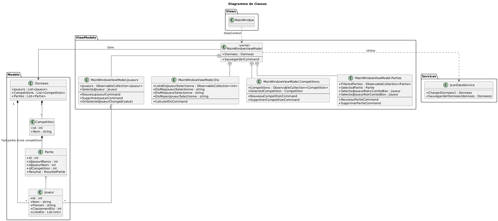
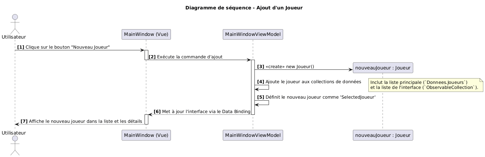
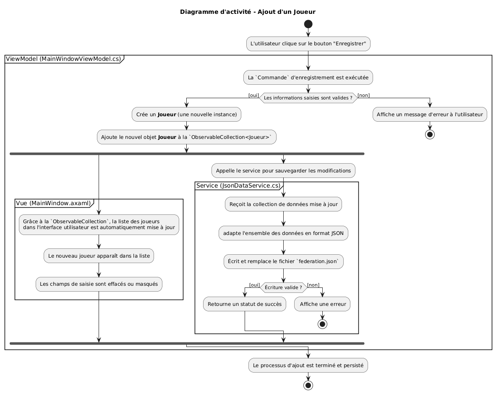

# Rapport Projet Programmation Orientée Objet

Dans le cadre du cours de Programmation orientée objet nous avons du faire un programme en c# afin d'exercer nos connaissances.
Le projet est un logiciel destiné à gérer des matchs d’une fédération d’échecs et sera utilisé par le personnel administratif de la fédération.
Celui-ci entrera les informations manuellement dans l'application.

La fonctionnalité suplémentaire que nous avons choisis est une page reprenant différentes statistiques tel que l'historique des Elos d'un joueur, son elo maximum, minimum et moyen. Nous faisons donc des requêtes dans un fichier nommé `data` afin de récupérer les données utiles à la page.

## Diagramme de Classe

## Diagramme de Séquences

## Diagramme d'Activité

Le projet est moyennement adaptable à une autre fédération : les joueurs sont déterminés par la couleur de leurs pièces et leur niveau est déterminé par leur elo.
Pour modifier l'appel des joueurs et leur classement il faudrait modifier le code déjà existant.
Pour le reste, on pourrait l'adapter en ajoutant des scripts dans `ModelViews` et dans `Models` mais il faudra par contre modifier `MainWindow.axaml` directement.

## Principes SOLID utilisés :

### Single Responsibility Principle

Chaque classe ou méthode n'a qu'une seule fonctionnalité, tout est découpé en blocs ne faisant qu'une seule chose. Pour prendre un exemple, les Modèles n'ont qu'un seule responsabilité : représenter et  contenir les données.
La classe Joueur ne fait rien d'autre que de stocker des informations sur un joueur (nom, ELO, historique ELO). Elle ne sait pas comment s'afficher à l'écran, ni comment être sauvegardée dans un fichier.

### Dependency Inversion Principle

Nous respectons simplement le pattern MVVM.
Par exemple, L'interface `MainWindow.axaml` dépend du ViewModel mais pas l'inverse.

## Une justification de qualités d'adaptabilité de notre projet à une autre fédération:

  1. l'accès aux données grâce au JsonDataService

  Un des deux points pour l'adaptabilité est que toute les fonctionnalités de lecture et d'écriture des données sont définies dans une seule classe : JsonDataService qui se trouve dans MonAppAvaloniaMVVM/Services/JsonDataService.cs.

 Le reste de l'application (les vues et les ViewModels) ne sait pas comment les données sont stockées. Il sait seulement qu'il doit demander au JsonDataService de les lui fournir à partir du JSON qui est un format général.

  2. l'interphace 

  On peut pointer du doigts le fait est que notre application est simple d'utilisation et adaptable à d'autres sport.

 Des mises à jour en temps réel : Grâce à l'architecture MVVM et aux ObservableCollection, n'importe quel modification comme l'ajout d'un joueur ou la mise à jour d'un score est instantanément appliqué dans toute l'application.

 Des interactions standards : On utilise des contrôles et des actions familiers (listes, formulaire, boutons "Ajouter", "Modifier" et "Supprimer"), ce qui rend le code adaptable pour n'importe quel Jeu/sport. Par exemple, il s'suffirait pour le tennis de remplacer les points "ELO" par "ATP" et de d'échanger la "victoire blanc/noir" par "victoire en 3 sets". 
  
En conclusion, notre code 
Aller Quentin travaille 
